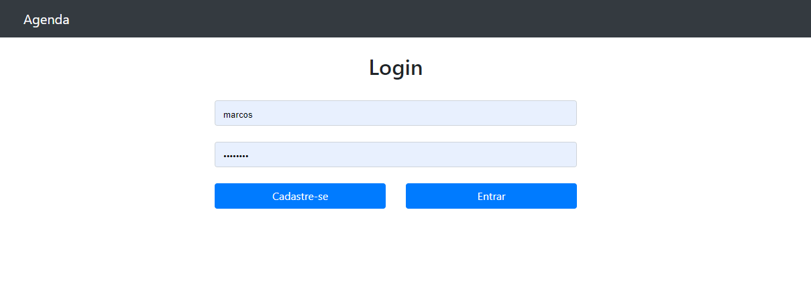
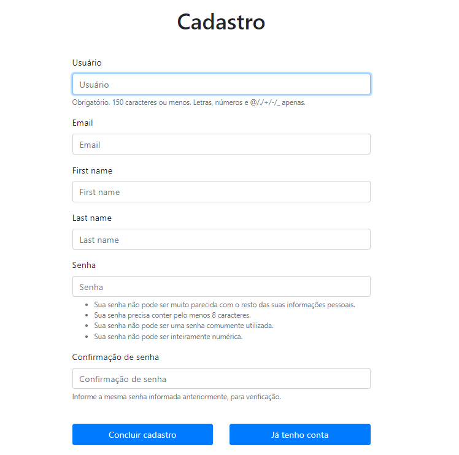
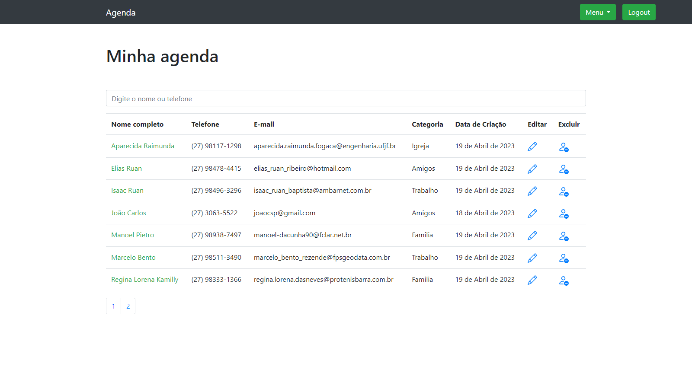
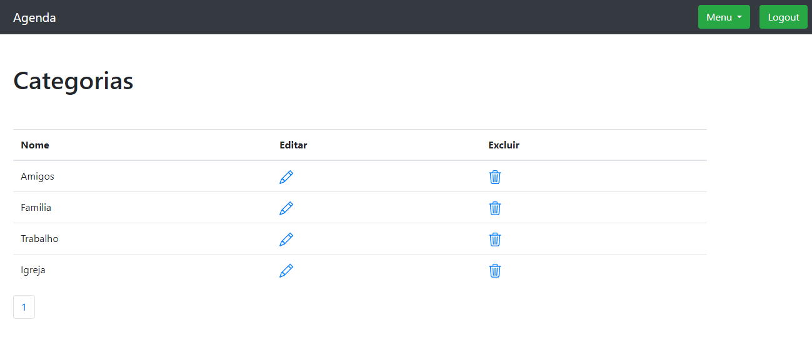
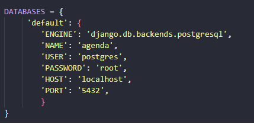

# Agenda de contatos

> Essa agenda foi feita em django com auxilio do bootstrap, também foi utilizado o banco de dados postgree

A agenda possibilita cadastrar usuário e fazer login. Após criar o cadastro você gerencia seus contatos, cadastrando categorias e foto do contato para facilitar o reconhecimento.

Cada usuário tem acesso somente aos contatos criados por ele mesmo, com excessão do usuário administrador que consegue ver todas as categorias e contatos através do painel administrativo do django.




-----



-----



-----



## Instruções de uso
1) Crie um diretório para o seu projeto e navegue até ele.

2) Crie um ambiente virtual Python usando a ferramenta venv. Você pode fazer isso executando o seguinte comando no terminal:

```python
    python -m venv myenv
```

No Linux e Mac OS execute o comando abaixo para ativar o ambiente virtual:

```sh
    source myenv/bin/activate
```

Windows:

```sh
    myenv\Scripts\activate
```

3) Instale as dependências do seu projeto a partir do arquivo requirements.txt usando o seguinte comando:

```python
    pip install -r requirements.txt
```

4) Crie a base de dados Postgree e edite o arquivo settings.py do projeto com a suas credenciais:

   


5) Digite o comando para verificar modificações da base de dados:

```python
    python manage.py makemigrations
```
6) Aplique as modificações:

```python
    python manage.py migrate
```

7) Pronto! Execute o comando abaixo para rodar o servidor django:

```python
    python manage.py runserver
```
